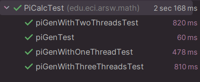

# ARSW-Lab01


## INTEGRANTES

### ANDREA VALENTINA TORRES TOBAR
### ANDRES SERRATO CAMERO


## Parte I Hilos Java

complete las clases CountThread, para que las mismas definan el ciclo de vida de un hilo que imprima por pantalla los números entre A y B.


Complete el método main de la clase CountMainThreads


Al ejecutar el codigo usando ```start()``` inician a ejecutarse los hilos de forma paralela y genera la siguiente salida  


Mientras que, al cambiar el inicio de ```Start()```  a ```run()``` no se ejecuta el siguiente hilo hasta que no termine la ejecucion del anterior y los numeros salen en orden


## Parte II Hilos Java

Para este ejercicio se requiere calcular, en el menor tiempo posible, y en una sola máquina (aprovechando las características multi-core de la mismas) al menos el primer millón de dígitos de PI (en base 16). 

Para esto, se creó una clase de tipo Thread que represente el ciclo de vida de un hilo 


La cual, en su método `run()` se encarga de calcular los dígitos de PI en base 16, desde el dígito i hasta el dígito j, usando la clase PiDigits con el método `getDigits(int start, int count)`.

Ahora bien, para calcular los digitos de PI, usando varios hilos, en la clase PiDigits, se crearon dos métodos usando sobrecarga, ambos se llaman igual pero cambia sus parametros y su función:

- `getDigits(int start, int count, int N)`: Este se encarga de crear los hilos, dividir el trabajo entre estos, iniciar los hilos usando `thread.join()`, lo cual, no le permite a un hilo continuar sin que haya terminado el anterior.Al iniciarlos llama al otro metodo con el mismo nombre pero sin el parametro n, al final concatena todos los hilos y entrega una respuesta en un array de bytes.
- `getDigits(int start, int count)`: Realiza la operación para calcular los numeros de PI.

Para probar el funcionamiento de la clase PiDigits, se crearon pruebas unitarias en la clase PiDigitsTest


las cuales se encargan de verificar que el resultado obtenido sea el esperado.




