# ARSW-Lab01


## INTEGRANTES

### ANDREA VALENTINA TORRES TOBAR
### ANDRES SERRATO CAMERO


## Parte I Hilos Java

Complete las clases CountThread, para que las mismas definan el ciclo de vida de un hilo que imprima por pantalla los números entre A y B.


Complete el método main de la clase CountMainThreads


Al ejecutar el código usando ```start()``` inician a ejecutarse los hilos de forma paralela y genera la siguiente salida  


Mientras que, al cambiar el inicio de ```Start()```  a ```run()``` no se ejecuta el siguiente hilo hasta que no termine la ejecución del anterior y los números salen en orden


## Parte II Hilos Java

Para este ejercicio se requiere calcular, en el menor tiempo posible, y en una sola máquina (aprovechando las características multi-core de las mismas) al menos el primer millón de dígitos de PI (en base 16). 

Para esto, se creó una clase de tipo Thread que represente el ciclo de vida de un hilo 

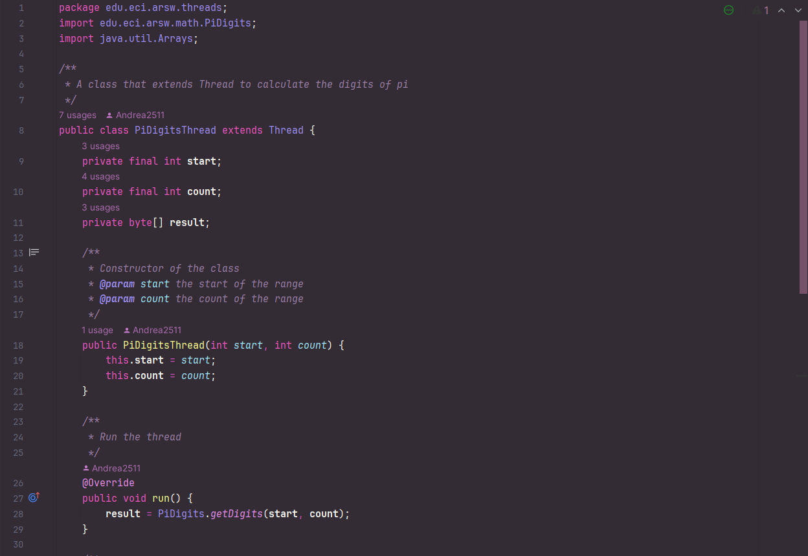

La cual, en su método `run()` se encarga de calcular los dígitos de PI en base 16, desde el dígito i hasta el dígito j, usando la clase PiDigits con el método `getDigits(int start, int count)`.

Ahora bien, para calcular los dígitos de PI, usando varios hilos, en la clase PiDigits, se crearon dos métodos usando sobrecarga, ambos se llaman igual, pero cambia sus parámetros y su función:

- `getDigits(int start, int count, int N)`: Este se encarga de crear los hilos, dividir el trabajo entre estos, iniciar los hilos usando `thread.join()`, lo cual, no le permite a un hilo continuar sin que haya terminado el anterior. Al iniciarlos llama al otro método con el mismo nombre, pero sin el parámetro n, al final concatena todos los hilos y entrega una respuesta en un array de bytes.
- `getDigits(int start, int count)`: Realiza la operación para calcular los números de PI.

Para probar el funcionamiento de la clase PiDigits, se crearon pruebas unitarias en la clase PiDigitsTest

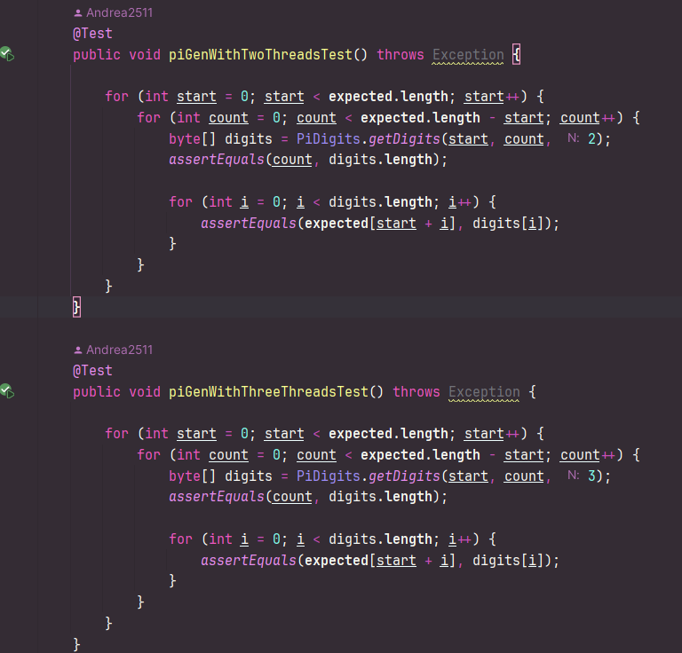

las cuales se encargan de verificar que el resultado obtenido sea el esperado.

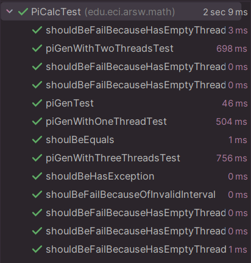

## Parte III Evaluación de Desempeño

A partir de lo anterior, implemente la siguiente secuencia de experimentos para calcular el millón de dígitos (hex) de PI, tomando los tiempos de ejecución de los mismos (asegúrese de hacerlos en la misma máquina):

- Un solo hilo.

Para un solo hilo el proceso de encontrar un millón de dígitos es largo, tarda aproximadamente 2 horas.

- Tantos hilos como núcleos de procesamiento (haga que el programa determine esto haciendo uso del API Runtime).

Para colocar el número de hilos igual al número de núcleos de procesamiento se utilizó el siguiente código:

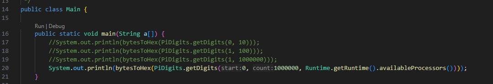

El cual se mostró en jVisualVM, lo siguiente:

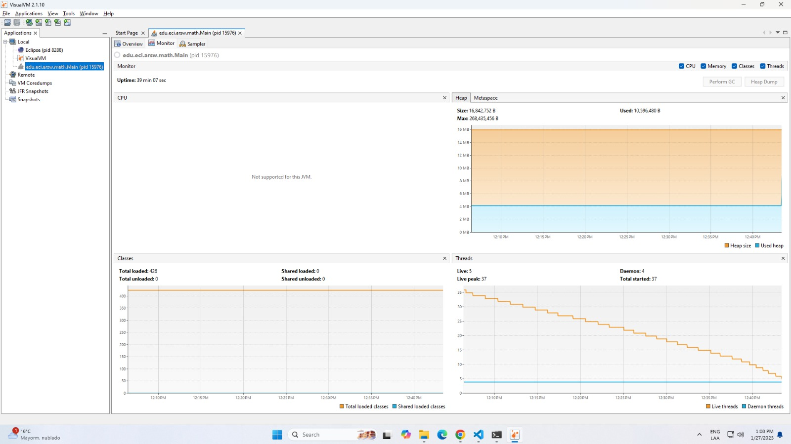

Tomándose un tiempo de 39 minutos con 7 segundos en calcular un millón de dígitos de PI.

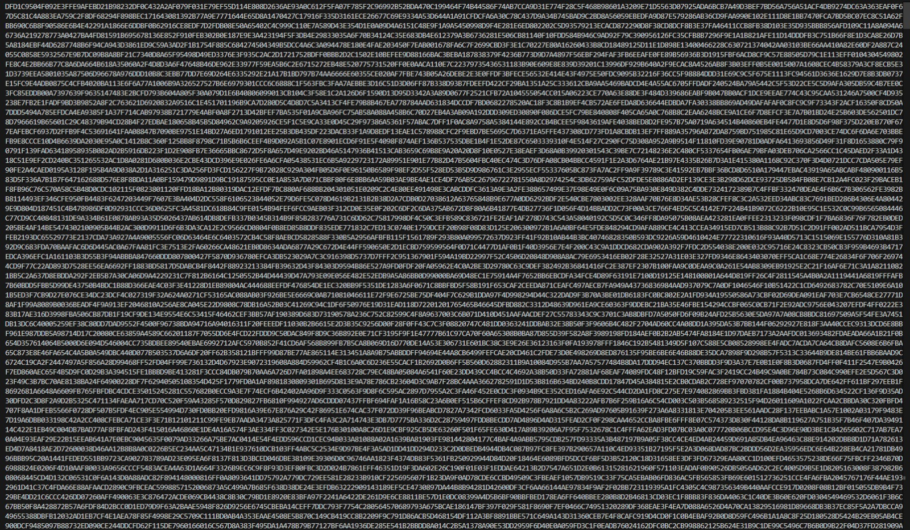

- Tantos hilos como el doble de núcleos de procesamiento.

Para este caso, se utilizó el siguiente código:

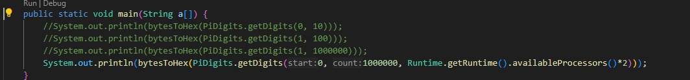

Mostrando en jVisualVM, lo siguiente:

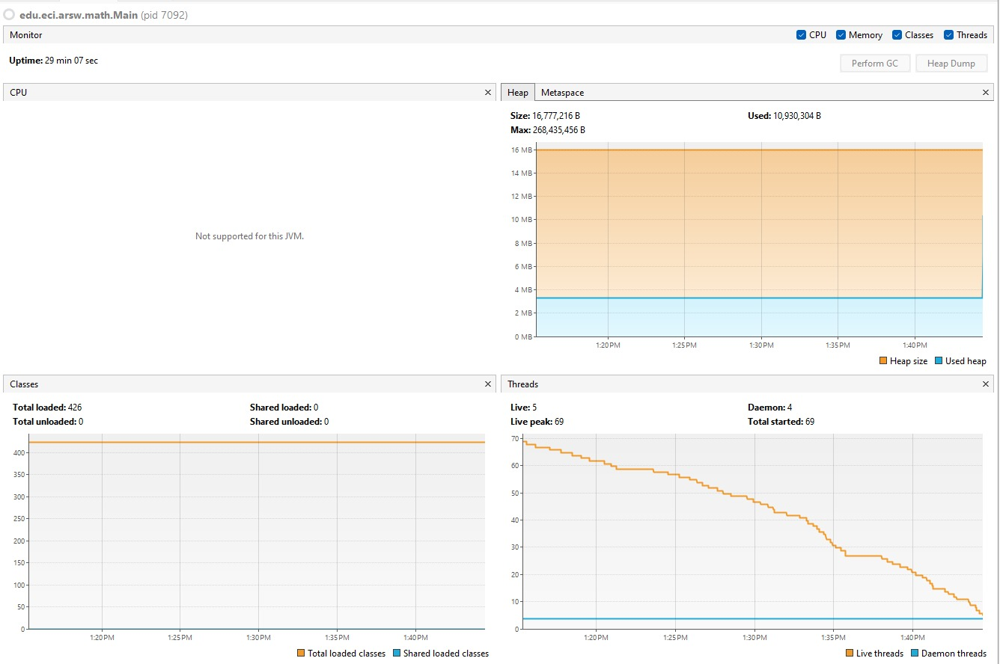

Tardando 29 minutos con 7 segundos en calcular un millón de dígitos de PI.

- 200 hilos.

Para este caso, se utilizó el siguiente código:

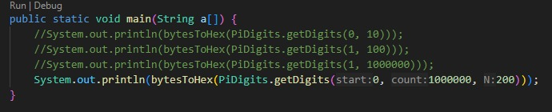

Mostrando en jVisualVM, lo siguiente:


Tardando 28 minutos con 27 segundos en calcular un millón de dígitos de PI.

- 500 hilos.

Finálmente, para este caso, se utilizó el siguiente código:

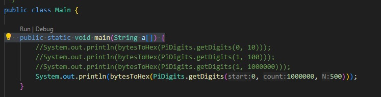

Mostrando en jVisualVM, lo siguiente:

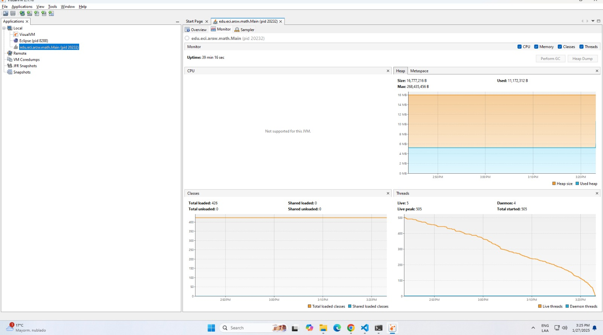

Tardando 39 minutos con 16 segundos en calcular un millón de dígitos de PI.

Con lo anterior, y con los tiempos de ejecución dados, se realizó la siguiente gráfica de tiempo de solución vs. número de hilos:

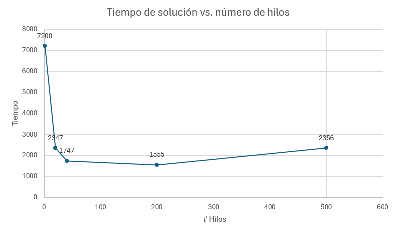

Donde se puede observar que el tiempo de solución disminuye al aumentar el número de hilos, por ejemplo, se puede observar que el tiempo de solución es menor al usar el doble de hilos que de núcleos de procesamiento, debido a que se está aprovechando al máximo los recursos de la máquina, pero llega un punto en el que el tiempo de solución se mantiene constante, esto se debe a que el número de hilos es mayor al número de núcleos de procesamiento, lo que genera un tiempo de solución mayor.

> ¿Por qué el mejor desempeño no se logra con los 500 hilos?, ¿cómo se compara este desempeño cuando se usan 200?

- Al usar 500 hilos, empieza a demorarse más que 200 hilos, debido a que al ser mayor que el número de núcleos de procesamiento, va a empezar a haber un cuello de botella, porque los hilos empezarán a competir por recursos compartidos como memoria, cachés y acceso a discos, afectando el tiempo de solución.

Esto se puede complementar con una aclaración que tiene la fórmula de Amdahl, este es que (1-p) es el valor de la fracción de un cálculo que puede ser paralelizado, y p es la fracción que no puede ser paralelizada, por lo que al aumentar el número de hilos, el tiempo de solución disminuye, pero llega un punto en el que se mantiene constante, debido a que la fracción que no puede ser paralelizada es mayor que la fracción que puede ser paralelizada, lo que genera un cuello de botella.

>¿Cómo se comporta la solución usando tantos hilos de procesamiento como núcleos comparado con el resultado de usar el doble de éste?.

- Al usar tantos hilos de procesamiento como núcleos, se puede observar que el tiempo de solución disminuye, debido a que se está aprovechando los recursos de la máquina, pero al usar el doble de hilos de procesamiento, se puede observar que el tiempo de solución disminuye aún más, debido a que se está aprovechando al máximo los recursos de la máquina, lo que genera un tiempo de solución menor.

> De acuerdo con lo anterior, si para este problema en lugar de 500 hilos en una sola CPU se pudiera usar 1 hilo en cada una de 500 máquinas hipotéticas, ¿la ley de Amdahls se aplicaría mejor?. 

- La Ley de Amdahl se aplicaría mejor porque no habría problema de recursos en las máquinas, pero también dependería de la comunicación entre estas, si estas no están bien coordinadas podría aumentar el tiempo.

> Si en lugar de esto se usaran c hilos en 500/c máquinas distribuidas (siendo c es el número de núcleos de dichas máquinas), se mejoraría?. Explique su respuesta.

- Podría ser más eficiente que el de 500 máquinas con 1 hilo cada una, ya que combina el uso de múltiples núcleos, reduciendo también la cantidad de máquinas, esto quiere decir que entre menos máquinas, existen menos posibilidades de que haya problemas de comunicación.